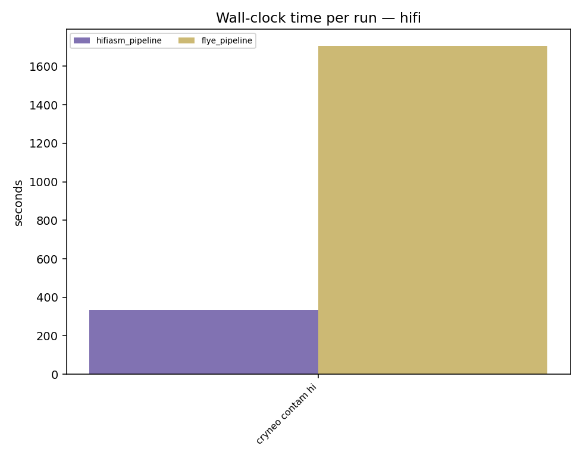
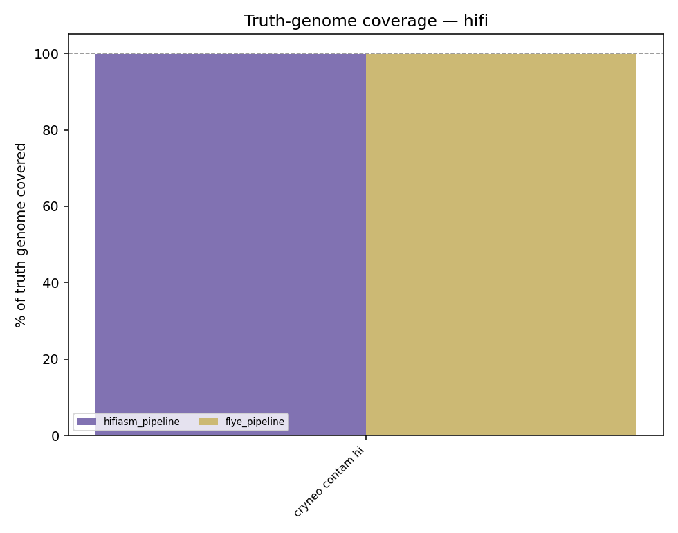
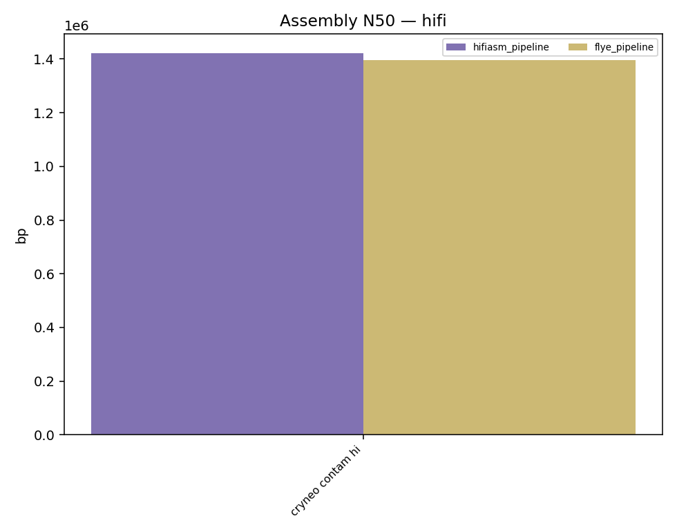
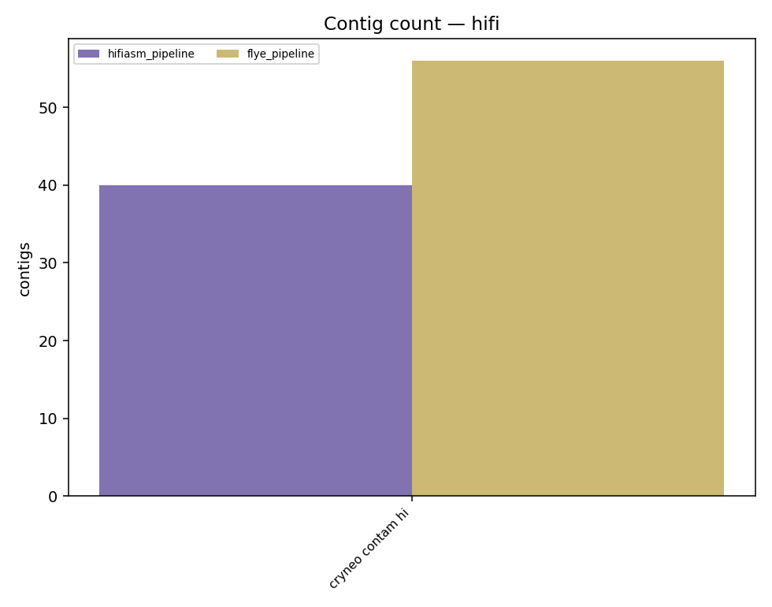
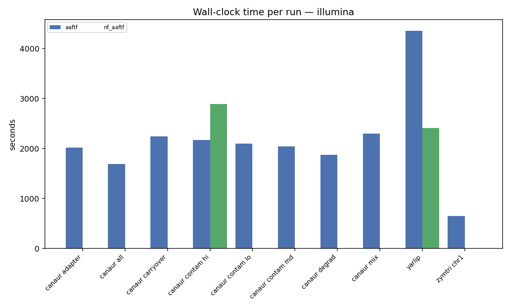
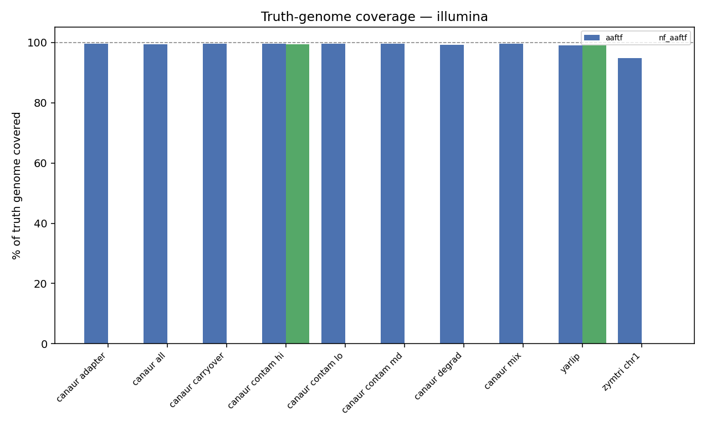
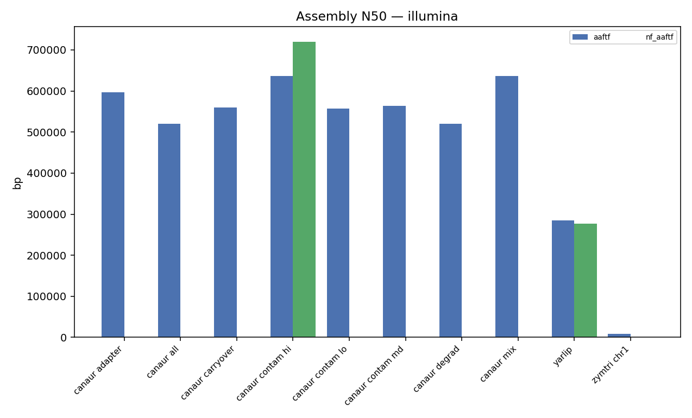
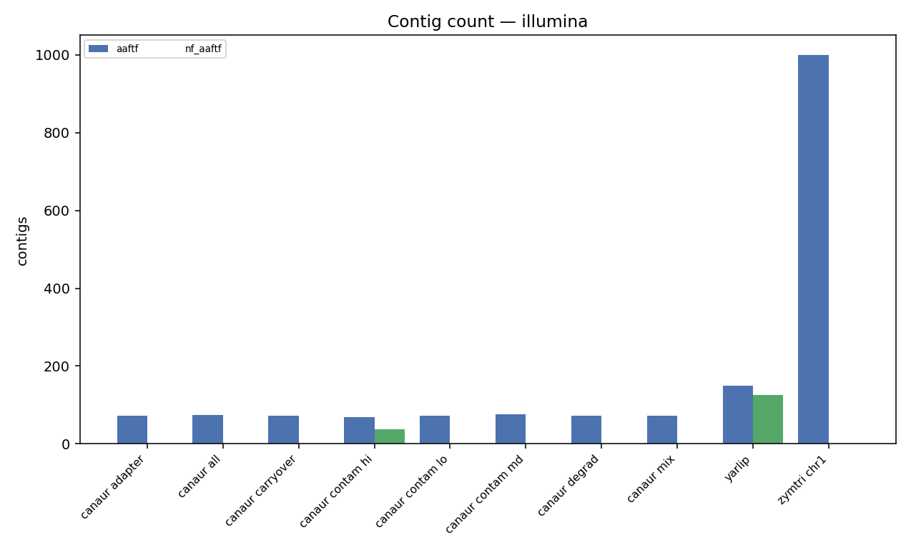

# Benchmark evaluation summary — 2026-08-19

Timing, assembly quality, and truth-genome accuracy for every pipeline validated end-to-end against real (non-placeholder) simulated datasets so far. Truth coverage is the union of `minimap2 -x asm5` aligned intervals against the truth genome, not a raw contig-length total, so redundant/overlapping contigs don't inflate the score.

**Figures and tables are split by sequencing technology.** A long-read HiFi assembler's wall-clock time and a short-read Illumina assembler's have no shared basis for comparison (different genome, different read chemistry, different scale) -- so each technology gets its own figure set, and within a figure the x-axis is the dataset, with one bar per pipeline that actually ran on it. Cross-technology numbers are never plotted on the same axes.

## hifi

### hifi — full results

| Pipeline | Dataset | Wall (s) | Contigs | Total (bp) | N50 | Truth cov % | Truth seqs hit |
|---|---|---:|---:|---:|---:|---:|---:|
| flye_pipeline | cryneo_sim_contam_hi_001 | 1706 | 56 | 21,646,167 | 1,397,269 | 99.85 | 15/15 |
| hifiasm_pipeline | cryneo_sim_contam_hi_001 | 335 | 40 | 19,921,979 | 1,421,616 | 99.92 | 15/15 |

## illumina

### illumina — full results

| Pipeline | Dataset | Wall (s) | Contigs | Total (bp) | N50 | Truth cov % | Truth seqs hit |
|---|---|---:|---:|---:|---:|---:|---:|
| aaftf | canaur_sim_adapter_001 | 2016 | 72 | 12,011,427 | 596,823 | 99.59 | 7/7 |
| aaftf | canaur_sim_all_001 | 1691 | 75 | 11,992,462 | 519,954 | 99.34 | 7/7 |
| aaftf | canaur_sim_carryover_001 | 2239 | 73 | 12,008,126 | 559,247 | 99.59 | 7/7 |
| aaftf | canaur_sim_contam_hi_001 | 2173 | 68 | 12,013,760 | 635,962 | 99.53 | 7/7 |
| nf_aaftf | canaur_sim_contam_hi_001 | 2894 | 38 | 12,011,267 | 720,160 | 99.32 | 7/7 |
| aaftf | canaur_sim_contam_lo_001 | 2096 | 72 | 12,009,166 | 557,181 | 99.49 | 7/7 |
| aaftf | canaur_sim_contam_md_001 | 2045 | 76 | 12,012,489 | 563,958 | 99.52 | 7/7 |
| aaftf | canaur_sim_degrad_001 | 1876 | 72 | 11,991,880 | 520,029 | 99.25 | 7/7 |
| aaftf | canaur_sim_mix_001 | 2301 | 73 | 12,009,866 | 636,519 | 99.57 | 7/7 |
| aaftf | yarlip_sim_001 | 4356 | 149 | 20,233,494 | 284,329 | 99.11 | 6/6 |
| nf_aaftf | yarlip_sim_001 | 2408 | 126 | 20,240,007 | 277,510 | 99.01 | 6/6 |
| aaftf | zymtri_sim_chr1_001 | 655 | 1000 | 5,677,261 | 8,958 | 94.75 | 1/1 |

## Notes

- `zymtri_sim_chr1_001` is a deliberately low-coverage (10x), single-chromosome fixture; its low N50/coverage here reflects the fixture design, not a pipeline defect.
- `cryneo_sim_contam_hi_001` runs (`hifiasm_pipeline`, `flye_pipeline`) were validated before the read-ID-collision simulator fix (see git history); results are unaffected since both adapters either tolerate or work around the collision.
- All runs used real containerized tools against real (not placeholder) simulated read data; none of these numbers are smoke-test placeholders.
